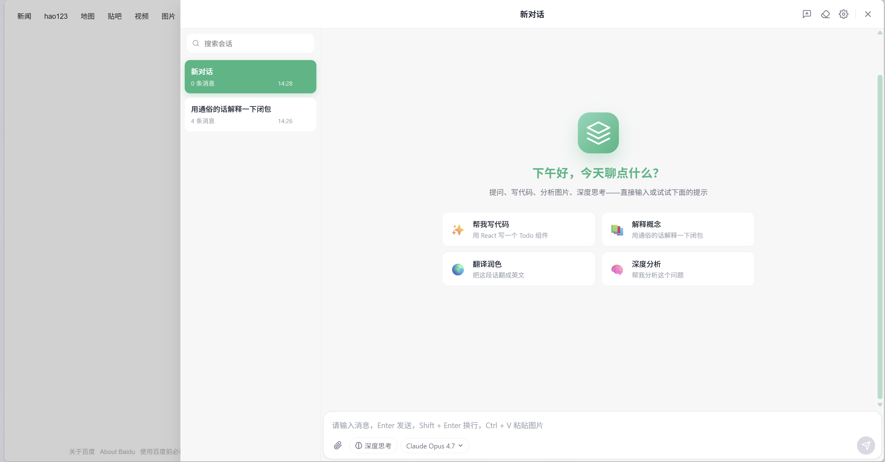
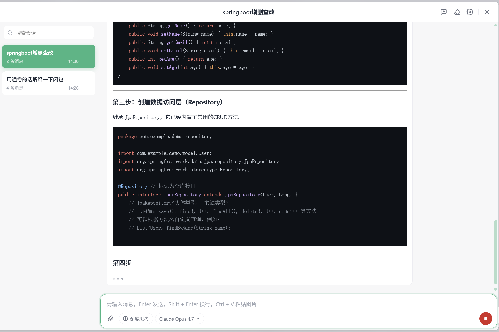
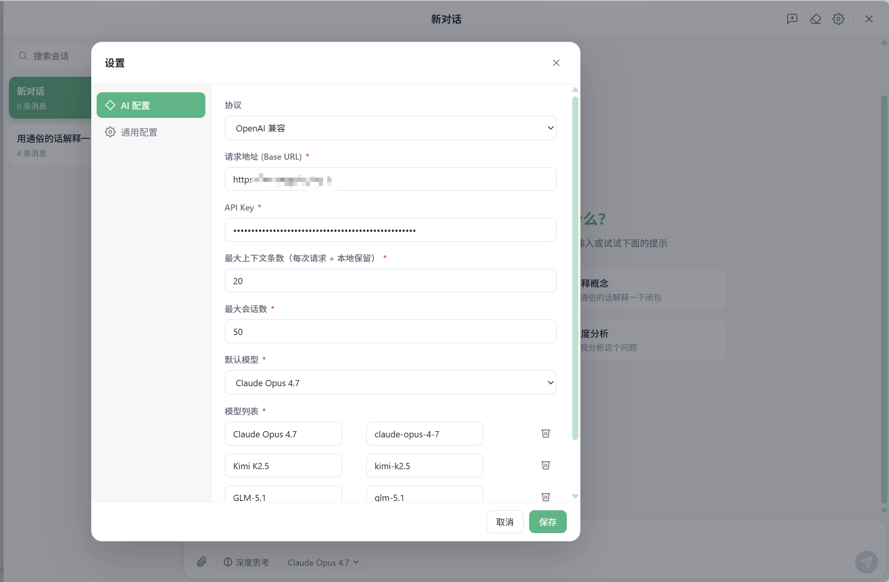
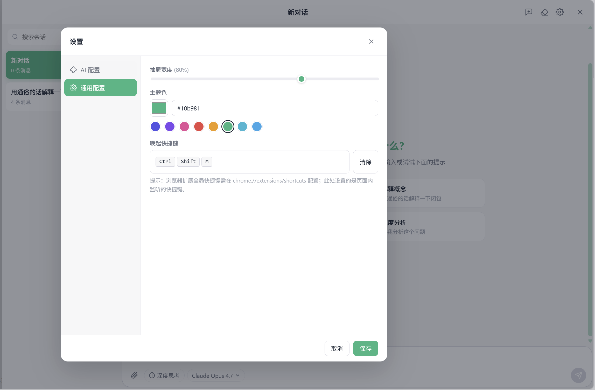

# browser-ai-chat

WXT + Vue 3 + Pinia 构建的浏览器 AI 对话插件，支持多模型、深度思考、流式响应、Markdown / 代码高亮 / KaTeX 公式渲染、可拖拽悬浮按钮、自定义快捷键和主题色。

<p align="center">
  
  
  
  
</p>

---

## 截图

### 主界面



### 对话进行中（含思考块、代码、Markdown）



### 设置 - AI 配置



### 设置 - 通用配置



---

## 特性概览

| 模块 | 说明 |
| --- | --- |
| 多会话 | 每个会话的消息、输入草稿、附件、模型选择、深度思考开关、滚动位置完全独立 |
| 多模态 | 文字 + 图片，支持上传附件和 `Ctrl + V` 直接粘贴图片 |
| 流式响应 | SSE 流式渲染，自动贴底跟随，用户上滚后停止跟随并显示「回到底部」按钮 |
| 深度思考 | 单独样式的思考块，仅在用户开启深度思考时才展示 |
| Markdown | 标题 / 列表 / 引用 / 表格 / 链接 + 代码高亮（highlight.js）+ 公式渲染（KaTeX） |
| 协议适配 | 默认 OpenAI 兼容；新增协议只需要继承 `BaseAdapter` 实现差异部分 |
| 多模型 | 设置内可维护任意模型列表，输入框内 pill 一键切换 |
| 设置 | 分「AI 配置 / 通用配置」双 tab，含校验，错误自动跳到对应 tab |
| 通用配置 | 抽屉宽度、主题色（含预设色板）、唤起快捷键（按键录制） |
| 持久化 | `chrome.storage.local`，跨标签实时同步，含本地数据上限保护 |
| 样式隔离 | Shadow DOM + 全部 `zwf-` 前缀，对宿主页面零污染 |
| 快捷交互 | 右键菜单（复制 / 删除）、自定义 toast、统一 ConfirmDialog、主题色滚动条 |

---

## 快速开始

```bash
# 安装依赖
npm install

# 开发模式（热更新）
npm run dev

# 生产构建
npm run build

# 类型检查
npm run compile
```

构建产物在 `.output/chrome-mv3/`。打开 `chrome://extensions`，开启「开发者模式」，点「加载已解压的扩展程序」选这个目录。

首次使用：

1. 工具栏点击扩展图标，或按 `Ctrl + Shift + M`（默认快捷键，可改）唤起
2. 右上角设置 → AI 配置 → 填 Base URL / API Key / 模型列表
3. 通用配置可改主题色、抽屉宽度、快捷键
4. 关闭设置开始聊天

---

## 工程结构

```
.
├── public/icon.png                    # 扩展图标
├── images/                            # README 截图
├── entrypoints/
│   ├── background.ts                  # 工具栏点击 / 命令快捷键 → 通知 content
│   └── content/
│       ├── index.ts                   # Shadow DOM 注入 + 全局 CSS
│       ├── App.vue                    # 顶层组件 + 主题应用 + 快捷键监听
│       └── components/
│           ├── FloatingButton.vue     # 悬浮按钮（拖拽 + tooltip）
│           ├── ChatDrawer.vue         # 抽屉容器 + 顶部按钮组
│           ├── ChatPanel.vue          # 左侧会话列表 + 右侧主区
│           ├── MessageList.vue        # 消息流 + 滚动跟随 + 一键到底
│           ├── MessageItem.vue        # 单条消息（用户/AI/思考/状态条）
│           ├── EmptyChat.vue          # 聊天空状态（引导卡片）
│           ├── MessageContextMenu.vue # 右键菜单
│           ├── InputBar.vue           # 输入卡片
│           ├── SettingsModal.vue      # 设置弹窗（双 tab）
│           ├── ConfirmDialog.vue      # 通用二次确认弹窗
│           └── ToastContainer.vue     # 顶部 toast 队列
├── src/
│   ├── adapters/                      # 协议适配层
│   │   ├── base.ts                    # BaseAdapter（含 SSE 解析）
│   │   ├── openai.ts                  # OpenAI 兼容实现
│   │   └── index.ts                   # 工厂
│   ├── stores/
│   │   ├── settings.ts                # 设置 store
│   │   └── conversations.ts           # 会话 store（CRUD / 流式 / clearAll）
│   ├── storage/index.ts               # wxt/storage 包装 + 默认值
│   ├── composables/useToast.ts        # toast 队列
│   ├── utils/
│   │   ├── markdown.ts                # markdown-it + highlight.js + katex
│   │   ├── shortcut.ts                # 快捷键解析 / 录制
│   │   ├── storage-sync.ts            # 防抖写入 + 跨页同步 + 回声忽略
│   │   └── file.ts                    # File → dataURL
│   ├── styles/global.css              # 全局样式（zwf- 前缀）
│   └── types.ts                       # 类型定义
├── wxt.config.ts                      # WXT 配置（manifest / icons / commands）
└── package.json
```

---

## 协议拓展

新增 Anthropic / Gemini 等协议时：

1. 复制 `src/adapters/openai.ts` 为 `anthropic.ts`，继承 `BaseAdapter`
2. 在 `chat()` 里改：URL、Headers、Body 结构、SSE chunk 解析
3. 在 `src/adapters/index.ts` 的 `createAdapter` switch 中加一个 case
4. 在 `SettingsModal.vue` 的 `providers` 数组中加上新协议选项

`StreamChunk`（`{ delta, reasoningDelta, done }`）是上下层的统一输出协议，业务层不需要关心具体协议差异。

---

## 主要技术决策

- **Shadow DOM 注入**：`@wxt-dev/module-vue` + `createShadowRootUi`，杜绝宿主页面样式污染。`:host` 上重置 `text-align / letter-spacing` 等可继承属性，避免宿主样式漏进来
- **CSS 变量 + `color-mix`**：主题色通过 `--zwf-primary` 在 shadow host 上动态 setProperty，所有派生色（hover 软色、阴影、滚动条）都用 `color-mix(in srgb, var(--zwf-primary) X%, ...)` 派生
- **流式贴底**：sentinel 元素 + `scrollIntoView({ block: 'end' })`，配合 `requestAnimationFrame` 二次校正，规避代码块 / 表格 / KaTeX 等异步布局造成的滚不到底
- **响应式**：流式消息用 `reactive()` 显式包装后 push 进数组，避免 Vue 3 reactive 数组对原始对象的隐式包装歧义导致 UI 不更新
- **Storage 回声防抖**：自己 `setValue` 后会触发 `chrome.storage.onChanged` 同 tab 回声，需要时间戳锁忽略，否则 reactive proxy 会被反序列化的 plain 对象替换。`src/utils/storage-sync.ts` 抽出复用
- **UTF-8 修复**：Vite 6 默认 `esbuild.charset: 'utf8'`，hljs / katex 的特殊字节会触发 Chrome content script 「不是 UTF-8」加载错误，强制 `charset: 'ascii'` 解决

---

## 已知限制 / TODO

- highlight.js 全语言加载，bundle 偏大；可换 `highlight.js/lib/common` 节省 ~600KB
- KaTeX CSS 通过 `@import` 内联到 Shadow，离线可用但增加体积
- Anthropic / Gemini 协议适配尚未实现（占位）
- 浏览器扩展全局快捷键（页面未打开也能唤起）只能在 `chrome://extensions/shortcuts` 修改，本插件设置页面里的快捷键是 content script 内监听

---

## License

MIT
